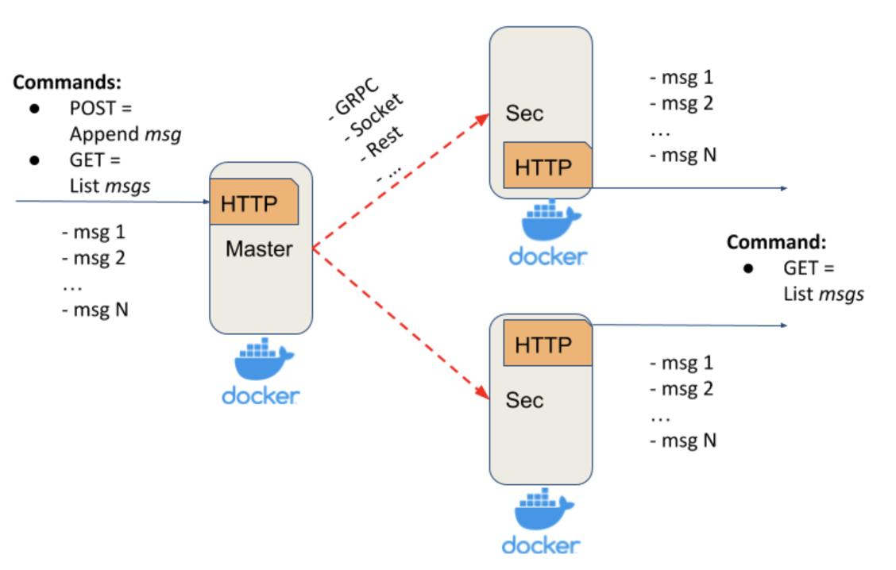
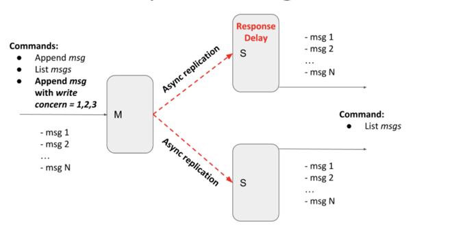
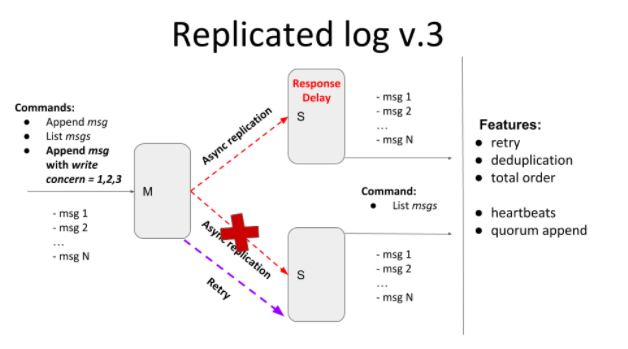

# Distributed Systems

UCU Data Engineering "Distributed Systems"

## Replicated Log Task

The course task is to develop a **distributed replicated log application** and implement different synchronization
techniques.

> **Reference:** https://docs.google.com/document/d/13akys1yQKNGqV9dGzSEDCGbHPDiKmqsZFOxKhxz841U/edit

### Lucky Team Members

* [@sadliak](https://github.com/sadliak) - primary node (`replicated_log_primary` service & repository setup)
* [@mklovak](https://github.com/mklovak) - secondary node 1 (`replicated_log_secondary_1` service)
* [@vbarbanyagra](https://github.com/vbarbanyagra) - secondary node 2 (`replicated_log_secondary_2` service)

### Running

> **Make sure to install [Docker Compose](https://docs.docker.com/compose/install/)**

Run this distributed application using such command:

```shell command
$ docker-compose up
```

### Deployment Architecture & Assumptions

* **1** Primary node, **N** (any number) Secondary nodes
* Primary and Secondary nodes should be run as separate applications in Docker containers
* Any RPC framework can be used for inter-node (Primary - Secondary) communication
  (sockets, language-specific RPC, HTTP, REST, **gRPC**, etc.)
* Primary node should expose a simple HTTP server with:
    * `POST` method – appends a message into the in-memory list
    * `GET` method – returns all messages from the in-memory list
* Secondary node(s) should expose a simple HTTP server with:
    * `GET` method – returns all replicated messages from the in-memory list

### Iteration 1



#### Properties & Assumptions

* After each `POST` request, the message should be replicated on every Secondary server
* Primary should ensure that Secondaries have received a message via ACK
* `POST` request should be finished only after receiving ACKs from all Secondaries (**blocking replication approach**)
* To test that the replication is blocking, a delay/sleep on Secondaries should be introduced
* The communication channel is a **perfect link** (no failures and messages lost)

### Iteration 2



#### Properties & Assumptions

* An additional write concern `w` POST request parameter should be defined to provide tunable replication
  semi-synchronicity. This parameter should specify how many ACKs the Primary should receive from Secondaries before
  responding to the client:
    * w = 1 - ACK only from Primary, no ACKs from Secondaries
    * w = 2 - ACK from Primary and 1 Secondary
    * w = 3 - ACK from Primary and 2 Secondaries
* An artificial delay should be introduced on Secondaries to emulate replicas inconsistency (and eventual consistency).
  In this case, Primary and Secondary should temporarily return different messages lists.
* Guarantee the total ordering of messages (don't show later messages on secondaries if at least one previous was not
  received) and do deduplication of messages on secondaries.

### Iteration 3



#### Properties & Assumptions

* Main:
    * Tunable semi-synchronicity for replication with a retry mechanism that should deliver all messages **exactly-once
      in total order** should be implemented.
    * All messages should be present exactly once in secondary nodes - **deduplication**.
    * The order of messages must be the same in all nodes - **total order**.
    * If message delivery fails (due to connection, or internal server error, or secondary is unavailable) the delivery
      attempts should be repeated - **retries**. Retries could be infinite or have some **smart** logic.
    * All messages that secondaries have missed due to unavailability should be replicated after (re)joining the
      primary.
* Additional:
    * **Heartbeats** – implement a heartbeat mechanism to check secondaries’ health (status).
        * Possible statuses: Healthy, Suspected, Unhealthy.
        * They could help make your retries smarter.
        * You should have an API on the primary to check secondaries’ – GET `/health` (`/api/v1/health`)
    * **Quorum append** – If there is no quorum the primary should be switched into read-only mode and
      shouldn’t accept message append requests and should return the appropriate message
